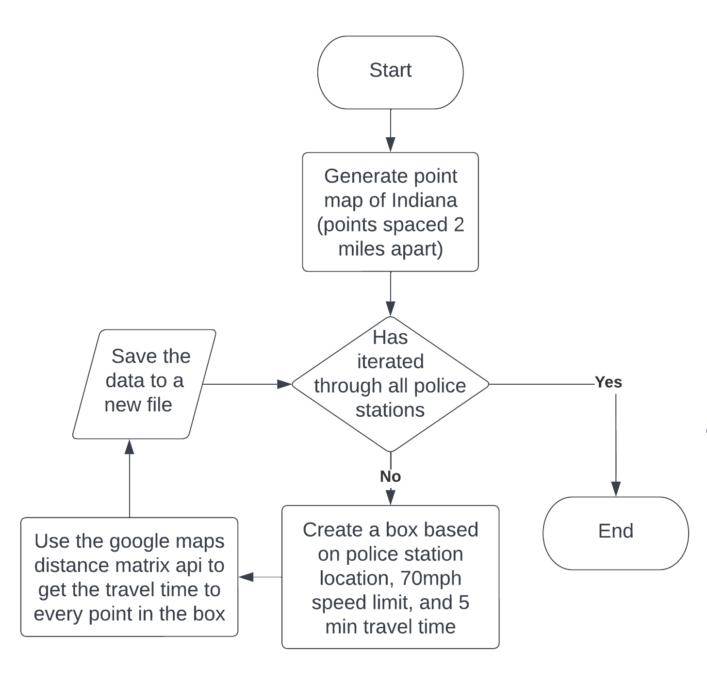
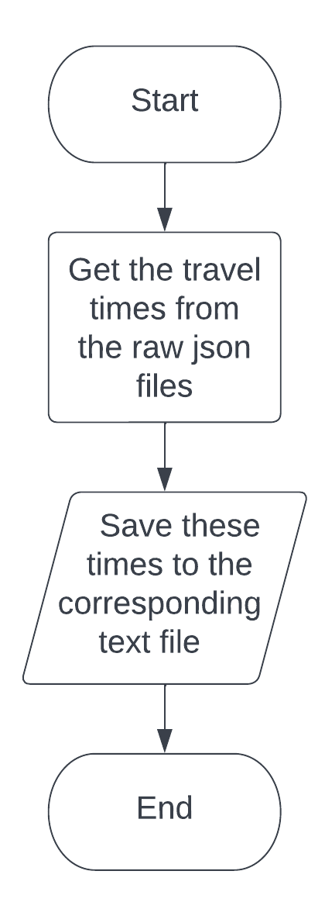
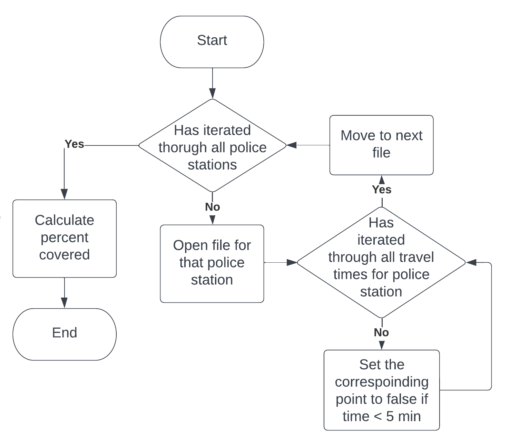
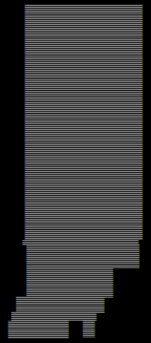

# PercentCoveredByAmbulences
Ok I know I misspelled ambulances but I'm too lazy to fix it.

## Table of Contents  
1. [How the Programs Work](#how-the-programs-work)
2. [Result](#result)
3. [Usage](#usage)
4. [Flaws](#flaws)
5. [Tools I Used](#tools-i-used)

## How the Programs Work

### Overview
This is split into 3 programs: download data, organize data, and calculate coverage. The reason I wrote 3 programs as opposed to 1 or 2 is because I wanted to keep each program as simple as possible, especially when dealing with something that could cost me money if I'm not careful (the google maps api is free up until a certain limit).

### Download Data
This program downloads the data from the google maps api and saves it to json file inside of the folder RawData. Here is a flowchart of this program:

If you look inside of PercentCoveredByAmbulences/RawData, all the files are named in the format \[police station number\]\[a or b\].json. Inside of station_coordinates.cpp there is an array of all the police station coordinates. The police station number is just the index of which that police station's coordinate is listed inside of this array. The reason I have two files for each police station (hence the a or b) is because the google maps api only allows 25 coordinates per request, and some boxes contain more than 25 points, so I have to split it up into two requests.

### Organize Data
This is a very simple program which extracts the travel times from the json files and outputs them to a txt file inside of the folder PercentCoveredByAmbulences/TravelTimes. Flowchart of this program:

Each of the text files are named in the format \[police station number\].txt.

### Calculate Coverage
Calculates the number of points that are covered over the total points. Points that are covered are points that the ambulance can drive to within 5 minutes. Flowchart:

This program gets the number of points that are covered by creating a point map of Indiana, initializing each point as true, and then setting each point to false if the point is covered.

## Result
The output of the calculate coverage program was "Coverage: 15.35374868% (1454/9470)". Therefore, about 15% of Indiana can be reached by driving 5 minutes from all police stations.

## Usage

### Overview
There are three .exe files in the PercentCoveredByAmbulences folder: download_data.exe, organize_data.exe, and calculate_coverage.exe. These are the three programs I mentioned in [How the Programs Work](#how-the-programs-work). For more info on each of them, check out [that section](#how-the-programs-work).

### Download Data
**WARNING: RUNNING THE DOWNLOAD DATA PROGRAM TOO MANY TIMES IS NOT FREE.** You get $200 of free credit each month but if you go over that you will have to pay. This program will make about 1100 api requests, which for me used $96 - $98 of my credit.

The first thing you need to do to run this program is to get a google maps api key. Go to https://developers.google.com/maps/documentation/distance-matrix/get-api-key for instructions on how to get one.

Next, you can run download_data.exe. The program will prompt you for your api key, and when you enter it it will start downloading the files. Make sure there is a folder called RawData in the same directory as your .exe file or it will not work.

### Organize Data
Make sure organize_data.exe is in the same directory as your RawData folder. You will also have to have another folder called TravelTimes in the same directory.

Once you've made sure that's fine you can run organize_data.exe.

### Calculate Coverage
Make sure calculate_coverage.exe is in the same directory as your TravelTimes folder. Then you can run it.

### Compiling It Yourself
In order to compile the download data program yourself, you need to have libcurl installed. Here's a good tutorial on how to install it: https://youtu.be/q_mXVZ6VJs4. If you want to compile one of the other programs then you can just comment out get_api_data.cpp and compile it normally.

To compile the download data program, uncomment main_download_data.cpp, comment out main_organize_data.cpp, and comment out main_calculate_coverage.cpp. Then just press the run button in visual studio. (idk how to compile it in the terminal since it uses the libcurl library)

To compile the organize data progaram, comment out main_download_data.cpp, uncomment main_organize_data.cpp, and comment out main_calculate_coverage.cpp. Then press the run button in visual studio or use g++ to compile it with O3 optimization.

To compile the calculate coverage program, do the same thing as the organize data program except uncomment main_calculate_coverage.cpp.

## Flaws
This program is a bit scuffed, and I could not live with myself if I didn't address the scuffness.

First of all, the point map leaves out pockets of Indiana because the south side of the border is blad. Here's a picture of the point map:

I should've probably modeled the border with a polyline and then checked if the points were inside the border but I didn't realize that was a thing I could do. (Something like this: https://www.geeksforgeeks.org/how-to-check-if-a-given-point-lies-inside-a-polygon/)

Another flaw is the fact that this program only tests 9470 points because of google maps api restrictions. This could probably be solved if I used an api with isochrone maps and then tested a lot more points to see if they were inside of the isochrone.

Finally, addressing the elephant in the room, I'm assuming that all the ambulances start from police stations. It's tough to find out the locations of ambulances in Indiana so I went with police stations. I don't think this would make my estimates too egregiously far off though.

## Tools I Used
Police station locations source: https://koordinates.com/layer/108466-indiana-police-stations/data/

Geocode google sheets plugin to convert the police station addresses to earth coordinates: https://workspace.google.com/marketplace/app/geocode_by_awesome_table/904124517349

Aayush Chaturvedi's code for calculating the distance between two points on Earth: https://www.geeksforgeeks.org/program-distance-two-points-earth/

Google Maps distance matrix api: https://developers.google.com/maps/documentation/distance-matrix

Libcurl for downloading the data from the google maps api: https://curl.se/libcurl/
